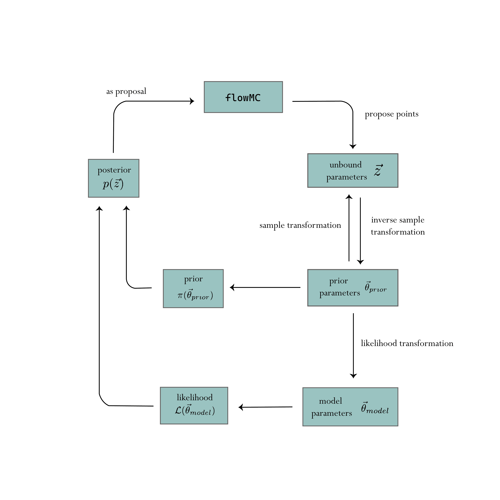

# Jim's parameter transform system

!!! warning
    **Heavy development**: This is a work in progress and is subject to change. If you have any questions, please feel free to open an issue.

The parameterization of some fundamental quantities can have significant impacts on the performance of the sampler. For example, the masses can be parameterized in the component mass spaces $\mathcal{M}_1$-$\mathcal{M}_2$ or chirp mass-mass ratio $\mathcal{M}_c$-$q$. Because of the strong correlation in the component mass space, the geometry is much harder for a sampler to explore. This can lead to slow convergence and poor performance. The chirp mass-mass ratio space is much more isotropic and easier to explore, which is often the choice to expose to the sampler.

On the other hand, defining a prior in the component mass space is much more intuitive. The common prior of choice is uniform in the component mass space with some maximum and minimum mass. One may want to define the prior in the component mass space then sample in the chirp mass space. To make the problem even worse, there is yet another set of paraemeters one may want to choose, which is the set of parameters the model may want to take. For example, the waveform generator in ripple takes the symmetric mass ratio $\eta$ as input instead of the mass ratio.

So in a general setting, there could be three sets of parametrizations we can choose for our problem: a parameterization which we want to define our prior in, a parameterization which we want the sampler to see, and a parameterization which the model takes. To facilitate the transformation between these parameterizations, we introduce a naming system and a transform system to handle this.

A sketch of the transform system is shown below:


# Prior

## Setting up Priors
Prior represents the prior knowledge on the probability density distribution of the event parameters $\theta$. In Jim, we could set up priors using the prior class `jimgw.prior`. Suppose we want to define a uniform prior distribution for the parameter $x$, we could call the `UniformPrior` class:

```
from jimgw.prior import UniformPrior
prior = UniformPrior(0.0, 1.0, parameter_names=["x"])
```

Jim provides a number of built-in prior classes, including:
- `UniformPrior`
- `SinePrior`
- `CosinePrior`
- `PowerLawPrior`

A complete list of prior classes available can be found in the Jim documentation (not available yet).

### Multi-dimensional Priors
When working with multi-dimensional parameter space, we will usually want to define priors for each individual parameter first:

```
from jimgw.prior import UniformPrior
prior_x = UniformPrior(0.0, 1.0, parameter_names=["x"])
prior_y = UniformPrior(0.0, 2.0, parameter_names=["y"])
```

Once we have the individual priors defined, we can call the class `CombinePrior` to combine them into one single prior object:

```
from jimgw.prior import CombinePrior
prior = CombinePrior(
    [
        prior_x,
        prior_y,
    ]
)
```

The `CombinePrior` object takes a list of `jimgw.prior` objects as argument and combines them into one single prior object that can be fed to the Jim sampler as input.

# Transforms

## Setting up Sample Transforms
Sometimes the same event can be described by multiple different set of event parameters, and it exists some transform that transform from one set of parameters to another set of parameters. Suppose we want to define prior on one set of event parameters $\theta_{prior}$, but sample on another set of event parameters $z$, sample transform becomes useful. 

### Bound-to-unbound Transforms
To set up bound-to-unbound transform, we use the transform class `BoundToUnbound`:

```
from jimgw.transforms import BoundToUnbound
sample_transform = [
    BoundToUnbound(name_mapping = [["x"], ["x_unbounded"]], original_lower_bound=0.0, original_upper_bound=1.0),
    BoundToUnbound(name_mapping = [["y"], ["y_unbounded"]], original_lower_bound=0.0, original_upper_bound=10.0),
]
```

### Other Sample Transforms


## Setting up Likelihood Transform

